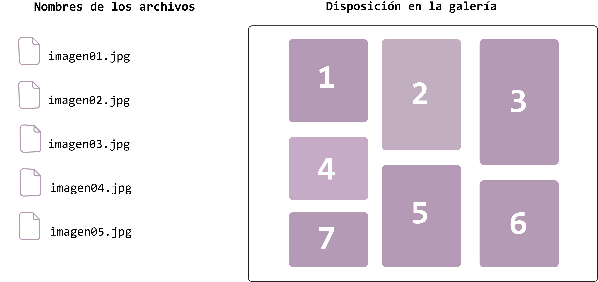
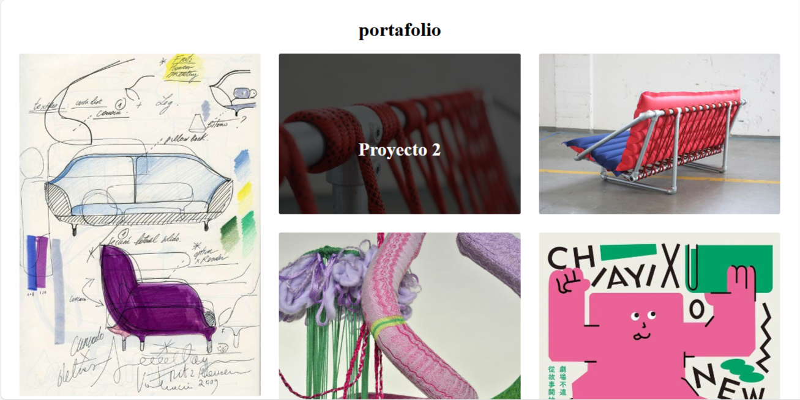

# 2024-06-14: Encargo 4

## Disposición y orden de imágenes al subirlas

[REPOSITORIO TEMPLATE](https://github.com/Pluumsy/PortafolioGaleria)

### Objetivo: 
Crear una galería de imágenes dinámica que se organiza en un diseño de rejilla "masonry". Las imágenes se cargan automáticamente desde una carpeta y se ordenan en filas, sin necesidad de conocer el número exacto de imágenes por adelantado.

### Desarrollo:

### 1. Definir sistema de nombres que funcione para subir imágenes secuencialmente.

- **Ruta de la carpeta de imágenes:** Todas las imágenes están almacenadas en una carpeta específica.

- **Búsqueda de Imágenes Existentes:** El script busca imágenes secuenciales (imagen01.jpg, imagen02.jpg, etc.) hasta que encuentra una que no existe, determinando así el número total de imágenes disponibles.

### 2. Reorganización en Filas:

- **Lectura de Columnas desde el CSS:** El script determina el número de columnas especificado en el CSS (3 columnas).

- **Reorganización Dinámica:** Las imágenes se reorganizan para que aparezcan en filas, permitiendo que los usuarios puedan ordenar sus imágenes, según sus proyectos de interés.

[GALERIA DE IMAGENES](pluumsy.github.io/PortafolioGaleria/)

Automatización: Los usuarios pueden subir imágenes a la carpeta sin necesidad de actualizar manualmente el código o la página.

Adaptabilidad: La galería se adapta dinámicamente a la cantidad de imágenes y al diseño de columnas especificado en el CSS.)

Automatización: Los usuarios pueden subir imágenes a la carpeta sin necesidad de actualizar manualmente el código o la página.

Adaptabilidad: La galería se adapta dinámicamente a la cantidad de imágenes y al diseño de columnas especificado en el CSS.
