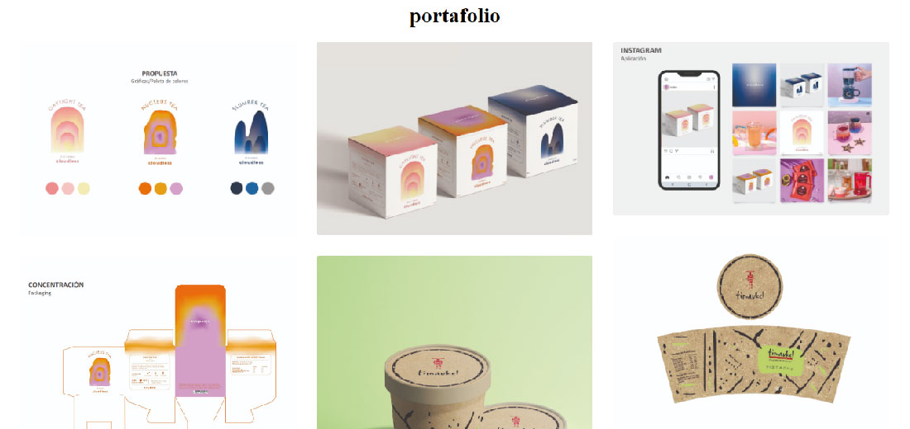

# encargo-05

Poblar el README.md del template que hiciste en <https://github.com/Pluumsy/PortafolioGaleria> , incluyendo instrucciones de uso breves, y si corresponde, decisiones de diseño que tomaste y desafíos pendientes. si alcanzas, agregar comentarios que consideres muy importantes en tu CSS.

----
### README.md
<https://github.com/Pluumsy/PortafolioGaleria>

### Prueba de template
<https://pluumsy.github.io/PortafolioCatalinaAlvarez/>

