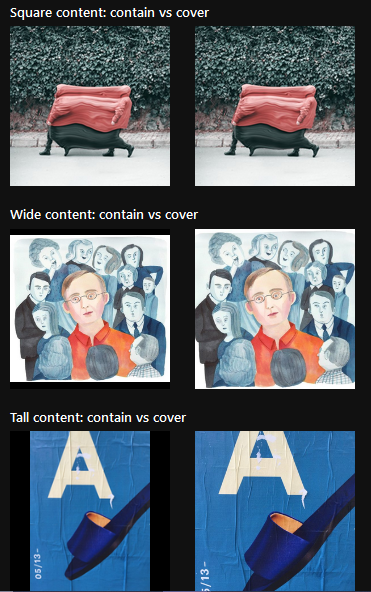
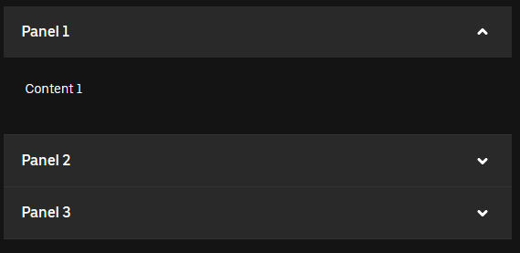
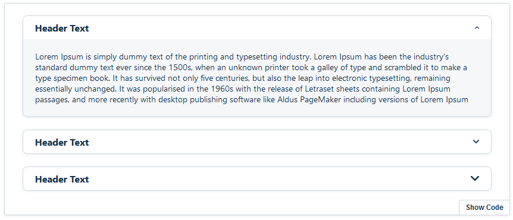
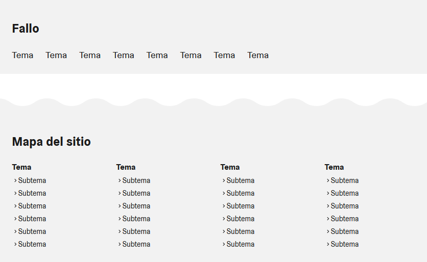
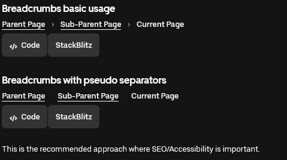

# **2024-04-19: Segundo encargo**

## **component.gallery**

### Elementos web

- **Hero**: Se utiliza para resaltar el contenido más importante de una página. Es el elemento visual más destacado, a menudo contiene una imagen de ancho completo.

En la pagina de [elisa.desing sistem](https://design.elisa.fi/9b207b2c3/p/2044c3-hero/b/1519c7) se puede encontrar el uso que se le puede dar a este elemento web y el codigo que estan utilizando para cada ejemplo. En esta pagina usan principalmente JSX(react). Por lo que ademas encontre [Bulma](https://bulma.io/documentation/layout/hero/) pagina en la cual lo muestran mas simple con codigo en HTML.

- **Imagen**: En un portafolio de diseñador la parte mas importante es el mostrar los proyectos, para esto es esencial las imagenes que se colocan y como estas se ordenan.

Estas imagenes son de [Gestalt](https://gestalt.pinterest.systems/web/image#Accessibility) y nos mustran distintas maneras de colocar imagenes, con texto encima, superposiciones o que las imagenes se adapten al margen que las contiene. Ademas de mostrarnos el codigo con el cual se realizo el ejemplo. Tambien esta la pagina de [Bulma](https://bulma.io/documentation/elements/image/) la cual muestra mas opciones para hacer con las imagenes, pero (a mi parecer) es mas amigable y con ejemplos mucho mas simples que la primera pagina.

- **Menu desplegable**: Es una pila vertical de encabezados interactivos utilizados para activar la visualización de más información; cada elemento puede ser 'colapsado' con sólo una etiqueta corta visible o 'expandido' para mostrar el contenido completo.

Pensando en el portafolio se podria colocar un menu desplegable, para ver algunos "tags" o los nombres de los trabajos o alguna otra manera de buscar, en verdad se le pueden dar varios usos. Encontre estas dos paginas [Base web](https://baseweb.design/components/accordion/) y [Crayons](https://crayons.freshworks.com/components/core/accordion/#demo) ambas muestran distintos ejemplos de estos menus de acordeon, ademas de tener los codigos con los cuales fueron realizados. 

- **Pie de pagina**: Es un elemento de la interfaz del sitio web y puede servir como contenedor principal para información clave para el ´portafolio, como navegación de utilidad, enlaces legales, notificaciones o enlaces a redes sociales.

Los pies de pagina ayudan a las personas a poder contactarse mas facilemnete, ademas de dar informacion improtante. para este elemento encontre la pagina de [Helsinki](https://hds.hel.fi/components/footer/code/) en la cual nos muestra diferentes ejemplos, el codigo que utilizan y las propiedades del codigo. 

## **Elementos adicionales**

Encontre algunas cosas que nos podrian ser utiles, pero nose si sean elementales para la creacion del portafolio, aun asi de igual manera lo queria colocar. 

- **Breadcrums**: Es un esquema secundario de navegación que revela la ubicación del usuario en una aplicación.

Esta la pagina de [Adobe Spectrum](https://spectrum.adobe.com/page/breadcrumbs/#Overflow) en la cual se muestran diferentes ejemplos, el codigo en css y o que se debe y no hacer con el elemento. Tambien esta la pagina de [Web Base](https://baseweb.design/components/breadcrumbs/) donde nos muestran el codigo y mas ejemplos. 

- **Tag**: Este elemento sirve para mostrar una colección de información concisa.

Los tags sirven para poder encontrar la informacion de manera mas precisa y rapida, ademas que en la pagina de [Web Base](https://baseweb.design/components/tag/) nos muestran varios ejemplos acompañados de sus codigos. 

- **Carga de archivos**: Es una zona donde arrastar los archivos para subirlos a la pagina web.

La pagina web de [Web Base](https://baseweb.design/components/file-uploader/) muestra varios ejemplos y sus respectivos codigos.
