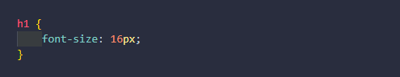
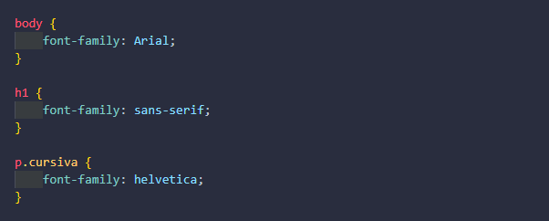
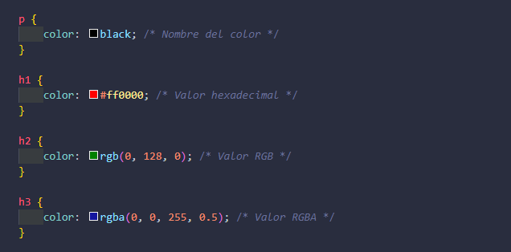
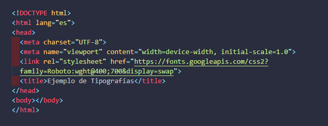

# encargo-05

## 2024-06-28 quinto encargo

## **Template: portafolio final**

### - [Plantilla portafolio](https://tessbb.github.io/portafolio-01/proyecto-01.html)

La plantilla, podría ser la base para los portafolios, es un primer acercamiento a una posible página web de un portafolio. 

### **Visualización portafolio** 

La página web es responsiva, respecto al tamaño de la pantalla de donde sea abierta, todo es editable. Dentro del mismo código van las instrucciones de uso, además de algunas “recomendaciones”.

