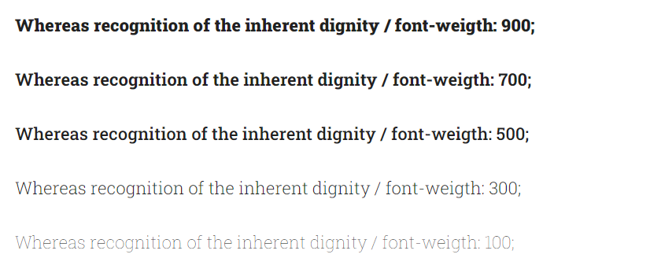
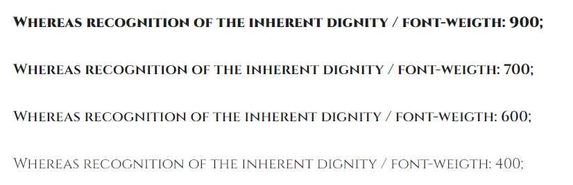
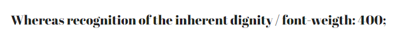

# **2024-06-14: Quinto encargo**

## **Manual para CSS**

### 1. Sintaxis Básica

- **"h1"**: Es un selector de etiqueta, existen muchos tipos de selectores.
- **"font-size"**: Este atributo se refiere al tamaño de la fuente o letra. Existen decenas de atributos para las más variadas necesidades de diseño.
- **"16px"**: Es el valor que estamos asignando, en este caso al atributo "font-size".​​

### 2. Selectores

- **Selector de elemento:** Selecciona todos los elementos de ese tipo.

  
- **Selector de clase:** Selecciona todos los elementos con una clase específica. Se usa un punto (.) antes del nombre de la clase.

  
- **Selector de ID:**  Selecciona un elemento único con un ID específico. Se usa una almohadilla (#) antes del nombre del ID.

### 3. Tipografías y tamaños

- #### Tipografía 
Para definir la tiporafía de los textos debes de poner la propiedad "font-family:". Aquí algunos ejemplos de cómo establecer diferentes fuentes:

- #### Fuente en Negrita y Cursiva

- #### Fuente con Peso Específico

- #### Tamaños 
Para definir el tamaño de los textos debes de poner la propiedad "font-size:". Los tamaños pueden especificarse en píxeles (px), ems (em), porcentajes (%) o puntos (pt). Recomiendo utilizar principalmente el pixel, ya que es una unidad fácil para comenzar a trabajar en CSS

### 4. Colores

- #### Colores de texto
La propiedad color define el color del texto. Puedes usar nombres de colores, valores hexadecimales, valores RGB o RGBA.

- #### Colores de fondo
La propiedad background-color define el color de fondo de un elemento.

### 5. Configuracion tipografía avanzado

#### Importar Fuentes desde Google Fonts
Para usar una fuente de Google Fonts, primero debes incluir un enlace en el <head> de tu HTML. Aquí tienes un ejemplo usando la fuente "Roboto":
- **HTML**

- **CSS**

- #### Uso de Varias Fuentes
Puedes definir varias fuentes para un elemento. El navegador usará la primera fuente disponible en el sistema del usuario.

## **Recomendaciones de tipografías de Google Fonts**

### Fuentes Serif
- **Roboto Slab**

[Roboto Slab](https://fonts.google.com/specimen/Roboto+Slab)

- **Merriweather**

[Merriweather](https://fonts.google.com/specimen/Merriweather)

- **Playfair Display**

[Playfair Display](https://fonts.google.com/specimen/Playfair+Display)

- **Noto Serif**

[Noto Serif](https://fonts.google.com/noto/specimen/Noto+Serif)

### Fuentes Sans Serif
- **Montserrat**

[Montserrat](https://fonts.google.com/specimen/Montserrat)

- **Lato**

[Lato](https://fonts.google.com/specimen/Lato)

- **Open Sans**

[Open Sans](https://fonts.google.com/specimen/Open+Sans)

- **Roboto**

[Roboto](https://fonts.google.com/specimen/Roboto)

### Fuentes Sans Serif
- **Cinzel:** Designed by Natanael Gama

[Cinzel](https://fonts.google.com/specimen/Cinzel)

- **Raleway:** Designed by Matt McInerney, Pablo Impallari, Rodrigo Fuenzalida

[Raleway](https://fonts.google.com/specimen/Raleway)

- **Alfa Slab One:** Designed by JM Solé

[Alfa Slab One](https://fonts.google.com/specimen/Alfa+Slab+One)

- **Abril Fatface:** Designed by TypeTogether

[Abril Fatface](https://fonts.google.com/specimen/Abril+Fatface)

- **Lobster:** Designed by Impallari Type

[Lobster](https://fonts.google.com/specimen/Lobster)

