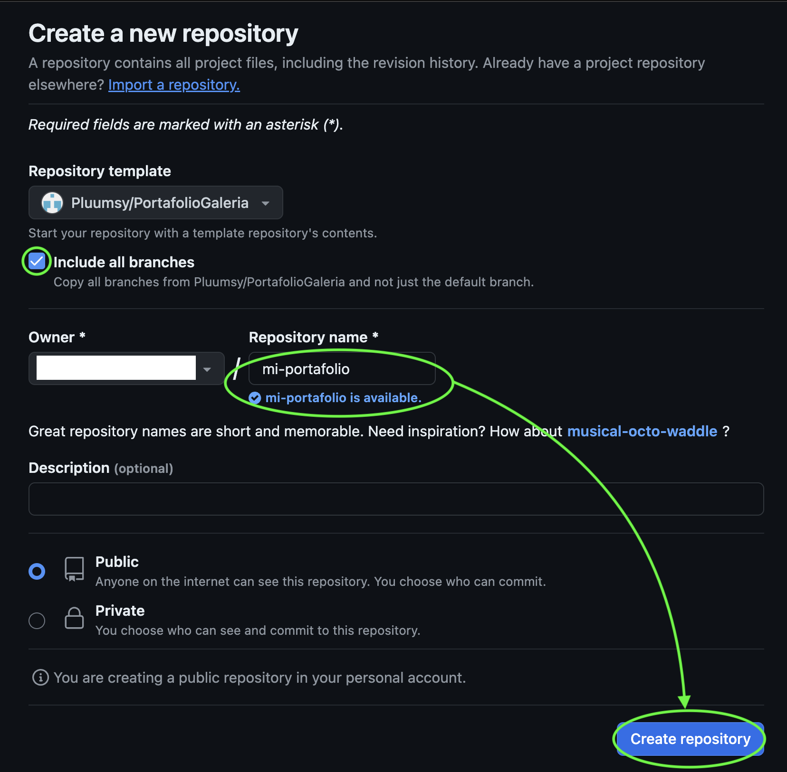
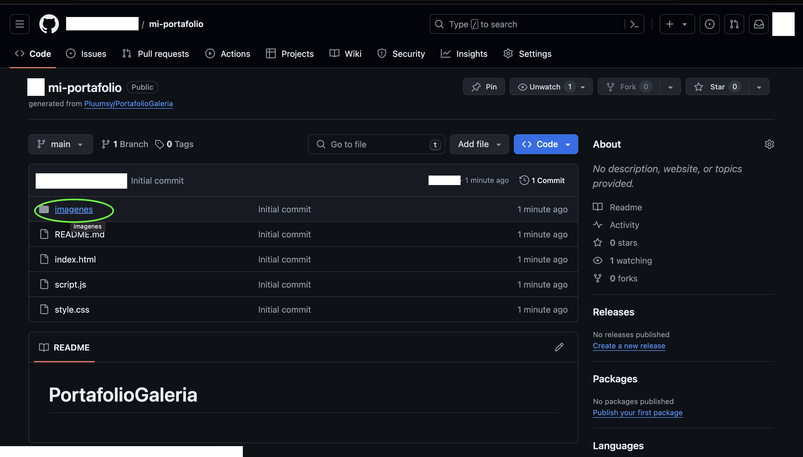
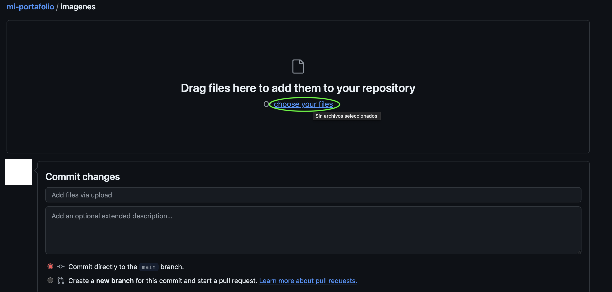
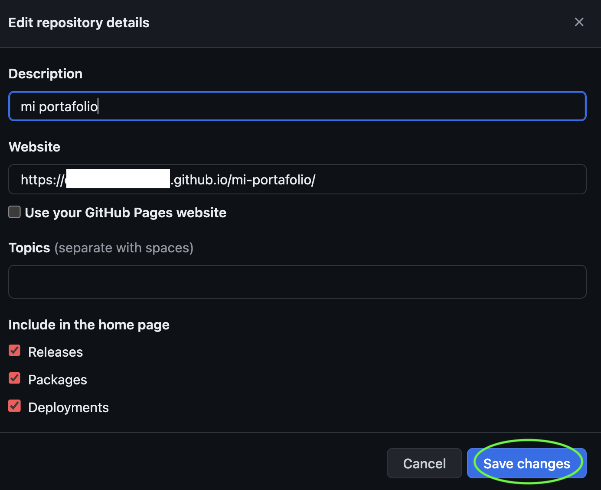
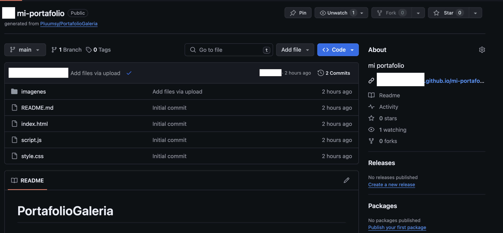

# fad9100-2024-1

Práctica electiva, diseño de software para crear portafolios digitales

## Acerca de

Práctica electiva

Curso de profundización

FAAD UDP

2024 primer semestre

## Equipo

- Aarón Montoya <https://github.com/montoyamoraga>
- Aylen Bassaletti <https://github.com/Tessbb>
- Catalina Álvarez <https://github.com/pluumsy>
- Janis Sepúlveda <https://github.com/janisepulveda>
- Sofía Huerta G. <https://github.com/capitaldebulgaria>
- Sofía Sandoval <https://github.com/ssofiasandoval>
- Valentina Montecinos <https://github.com/menteneon>

  ---

## Cómo usar _PortafolioGaleria_

Pulsa _**Use this template**_ (usar esta plantilla) y luego en la pestaña _**Create a new repository**_ (crear nuevo repositorio).

Ponle el nombre que desees que esté disponible y pulsa _**Create repository**_ (crear repositorio).

\*Asegúrate de seleccionar _**Include all branches**_ (incluir todas las ramas).

Cuando hayas creado tu repositorio, ingresa a la carpeta _**imagenes**_.

Presiona _**Add file**_ (añadir archivos) y luego _**Upload files**_ (cargar archivos).

Sube los archivos de tus proyectos, arrastrándolos o presionando _**choose your files**_ (elige tus archivos).

La nomenclatura (nombre) de los archivos deben ser imagen+ números de dos dígitos, _(01-02-03…-10-11-12)_ .formato a elección **Ejemplo: _imagen06.jpg_**

### _**\*Recuerda que el orden de tus imágenes se basará en el orden de los números.**_

Cuando ya hayas escogido tus imágenes aparecerán abajo.

Luego presiona _**Commit changes**_ (hacer los cambios) para que estén en la carpeta de imágenes.

---

## Cómo tener mi portafolio en un sitio web

Para obtener el _**link**_ (enlace) a la visualización de tu plantilla, presiona en _**Settings**_ (configuraciones) y luego _**Pages**_ (páginas).

Y luego cambia _**None**_ (ninguno) por _**Main**_ (principal) y _Github_ creará tu _**website**_ (sitio web). Para finalizar presiona _**Save**_ (guardar).

Añade el _**link**_ (enlace) a _**About**_ (sobre) presionando la tuerca.

Agrega una pequeña descripción y tu enlace en el espacio de _**Website**_ (sitio web).

Para terminar presiona en _**Save changes**_ (guardar cambios).

### Y así aparecerá en tu perfil para un acceso fácil y cómodo para quien quieras mostrarle tu portafolio.
