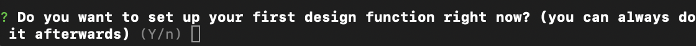
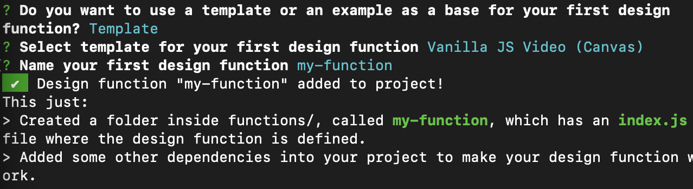
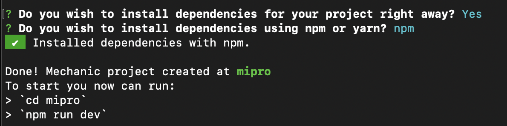
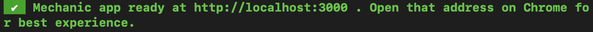

# 2024-06-14: examen

- Investigar la plataforma Mechanic.design
- A través de eso, analizar y hacer covers de los logos de la escuela. Por ejemplo: con un sketch sacar varios post para rrss.
- Proponer cambios en la documentación de Mechanic.design

## Introducción a mechanic.design

- Mechanic es una herramienta que te permite crear herramientas de diseño personalizadas basadas en web. Para comenzar a utilizarlo debes seguir los siguientes pasos.

### 1. Crear un proyecto con Mechanic

- Para crear un proyecto debes correr el siguiente comando en la terminal:

```sh
npm init mechanic@latest tu-proyecto
```

**Debes verificar** que tu computador tiene instalado Node.js (debe ser una version igual o superior a la 12.20) y npm

- Este comando creará una carpeta con el nombre asignado para tu proyecto. Además de mostrar las intrucciones para configurar el proyecto.



### 2. Estructura del proyecto

- Tu proyecto tendrá la siguiente estructura inicial:

```css
tu-proyecto/
├── src/
│   └── index.js
├── package.json
└── README.md
```

- src/index.js: archivo principal donde definirás la función de tu diseño.
- package.json: archivo de configuración del proyecto.
- README.md: documentación del proyecto.

### 3. Escoger una plantilla para tu primer diseño

- Al momento de escoger una plantilla se mostrará la opción de nombrar la función de tu proyecto:



### 4. Instalar dependencias con npm

- Cuando las dependencias estén instaladas aparecerán instrucciones para correr tu proyecto en un servidor local:



### 5. Abrir tu proyecto desde la terminal

- Deberás correr el siguiente comando en la terminal para ingresar a la carpeta donde se guardó:

```sh
cd tu-proyecto
```

- Posterior a esto correr el comando:

```sh
npm run dev
```

- Esto hará que se cree un servidor web con una dirección IP que corre local en tu computador:



### 6. Copiar y pegar dirección web en Google Chrome

- Al abrir la dirección web en un navegador, aparecerán los parámetros para comenzar a editar tu plantilla:

<https://github.com/disenoUDP/fad9100-2024-1/assets/144460794/63966927-fb34-4e52-91ad-b47edd246849>

## Bibliografía

<https://mechanic.design/>
