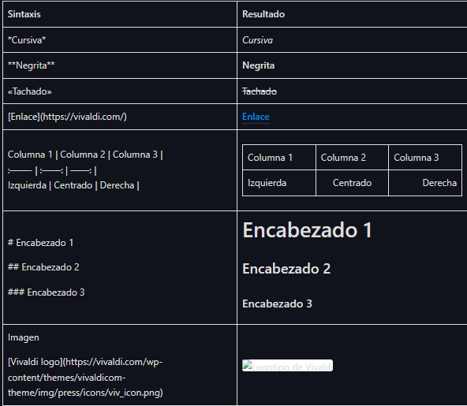
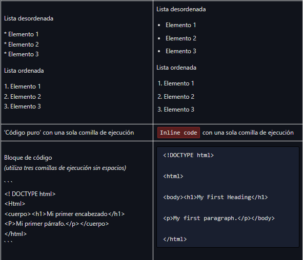
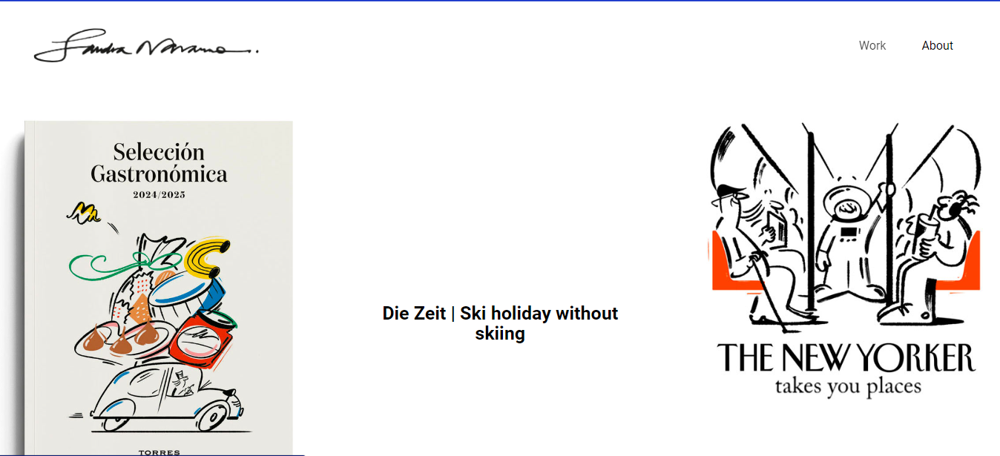
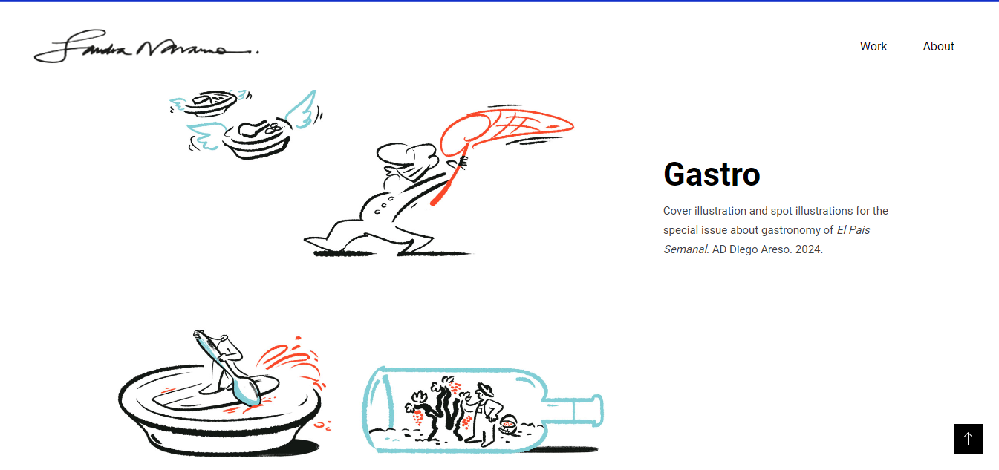
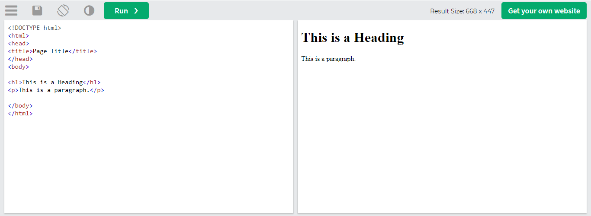

# Bitacora 1

## Git 

* " Git es un proyecto de código abierto maduro y con un mantenimiento activo que desarrolló originalmente Linus Torvalds, 
el famoso creador del kernel del sistema operativo Linux, en 2005. Un asombroso número de proyectos de software dependen de Git 
   para el control de versiones, incluidos proyectos comerciales y de código abierto. Los desarrolladores que han trabajado con Git 
   cuentan con una buena representación en la base de talentos disponibles para el desarrollo de software, y este sistema funciona a la 
   perfección en una amplia variedad de sistemas operativos e IDE (entornos de desarrollo integrados)." 
   
	* Información rescatada de https://www.atlassian.com/es/git/tutorials/what-is-git

## Markdown 

* " Markdown es un lenguaje simple que se utiliza para crear texto enriquecido (por ejemplo, HTML) con un editor de texto sin formato. 
 Te permite darle un formato básico al texto, utilizando símbolos conocidos y accesibles en todos los teclados. El tamaño de fuente,
 el color y otras opciones más avanzadas no están disponibles con Markdown. "
 
	* Información rescatada de https://help.vivaldi.com/es/cuenta-y-servicios/foro/formato-markdown/#:~:text=Markdown%20es%20un%20lenguaje%20simple,accesibles%20en%20todos%20los%20teclados. 

## Portafolios 

* Sandra Navarro:
  Me gusta mucho la forma en la que el mouse siempre tiene un papel principal al momento de moverse en el portafolio, este es eque crea la magia
  y da la informacion necesaria de cada uno de proyectos
  
  

  Por otro lado todo el tiempo se mantiene la información al lado de cada proyecto, es un texto que persigue a la imagen que se esta viendo
  
  
  
  * https://sandranavarro.co/

    
* Billelis
  Es bastante minimalista a la hora de su infromación pero de igual manera siempre estan presente los links directos a sus redes sociales 
  

  Nuevamente responde completamente a la interactividad del mouse 

  * https://www.billelis.com/gallery 

## Elementos para trabajar 

* css https://www.w3schools.com/css/tryit.asp?filename=trycss_default
  
  
* html https://www.w3schools.com/html/tryit.asp?filename=tryhtml_default
  
  
* js https://www.w3schools.com/js/tryit.asp?filename=tryjs_myfirst
  
  
* botones que responden https://www.w3schools.com/tags/tryit.asp?filename=tryhtml_button_test
  
  
* imagenes con filtro https://www.w3schools.com/css/tryit.asp?filename=trycss_ex_images_filters
  
