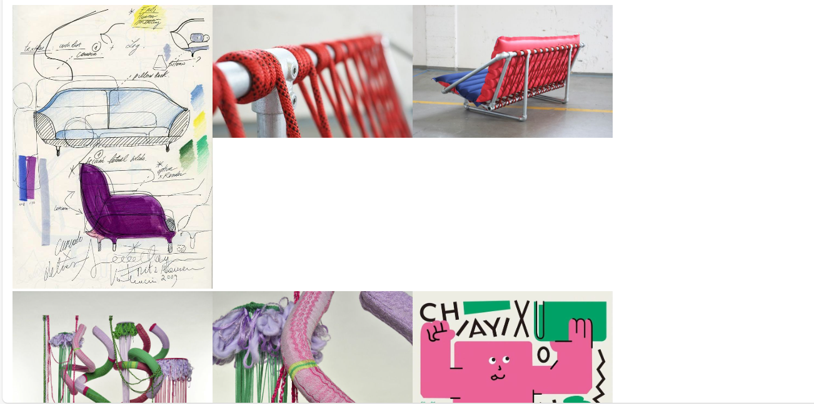
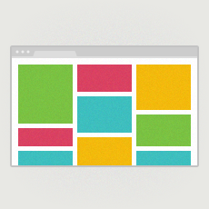

# Portafolio tipo galería de imágenes
## 2024-04-19: encargo 2

### **Pruebas**: CSS Flexbox y CSS Grid
- Los primeros acercamientos los realicé utilizando Flexbox, el mayor problema fue que si bien logré que las imágenes se vieran sin distorsión, no se podían ver completas ya que seleccionaba solo un fragmento y la encuadraba en el formato rectangular.

- Con Grid pude mostrar las imágenes completas, sin cortes, pero al momento de distribuirlas quedaban espacios vacios. Para solucionar esto se requiere uso de librerias que le añaden mucho peso.

------
### **Estructura** : MASONRY LAYOUT
- La forma de organizar los elementos fue a través de esta estructura que consiste en dividir el ancho de la pantalla en columnas y ajusta las diferentes secciones de la página a ellas. 
- Los elementos de la página son dispuestos en bloques y se acomodan según sus dimensiones para llenar mejor el espacio de la pantalla.
- Tendencia que se inició con Pinterest.

  

### Análisis de parámetros

#### Imágenes:
- Primero limité el ancho máximo de las imágenes al 100% del contenedor.
- Agregué un margen inferior de 30px, esta medida la tomé de algunos referentes que vimos de portafolios la entega pasada.
- Establecí el tipo de visualizacíon como bloque.
- Agregué bordes redondeados a las imágenes con un radio de 3px, debido a que queria darle un aspecto mas minimalista, el borde mas bajo tenia mas relación con la gráfica de la propuesta.

#### Columnas:
- Dividí el contenido en 3 columnas con un ancho minimo de 320px, ya que este es el ancho del celular.
- Establecí con "column-gap" el espacio entre las columnas en 30px, para que el margen de las imágenes coincida con el de las columnas.
